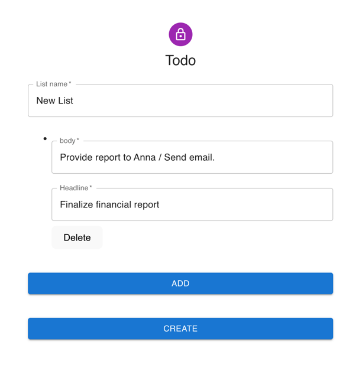

### Postgraphile + AWS lambda + SST

Proof of concept of deploying Postgraphile on AWS Lambda.

[https://www.graphile.org/postgraphile/](https://www.graphile.org/postgraphile/)

Official documentation for AWS lambda deployment:

[https://github.com/graphile/postgraphile-lambda-example](https://github.com/graphile/postgraphile-lambda-example)

This repository has some additional integrations i.e.

    Data migration from npm scripts
    Typescript typings
    Schema generation and caching
    SST integration
    React app integration. 

### Build

Install dependencies
```shell
yarn
```

Run SST in dev mode (remove sso script from package.json in case you don't use SSO)
```shell
yarn start
```

Run react client
```shell
yarn run dev
```
Login to the AWS Console -> Api Gateway -> Copy API URL. Replace Rest API URL in main.tsx

### Data migration

Run
```shell
yarn migrate
```

It will create database schema and populate with initial data.

### Features

Run the server and open `http://127.0.0.1:5173/todo`

Todo list implementation based on GraphQL schema autogenerated from RDS.

Typescript models are generated with graphql codegen tool. [URQL](https://formidable.com/open-source/urql/) is used on the client side.




Viewer to play around with autogenerated schema: `http://127.0.0.1:5173/view`

Schema is generated under `generated/schema.gql`. Typescript models under `generated/api.d.ts`.
You can change database in the `stacks/migration/db/init.sql`, add new tables with relations 1-N, N-N, run
`yarn migrate`. This will regenerate all typings and you can use viewer to query the data. 


Only queries are generated from the database. Mutations are disabled and implemented in the Typescript (Lambda code). 

### Notes
This is sandbox app. Some stacks are unsafe i.e. RDS endpoint is placed in public subnet!!!. Some settings are hardcoded i.e. API
URL in the file main.tsx.

Change also S3 bucket names in the S3Migration.ts - these originally are assigned to author's package name.
